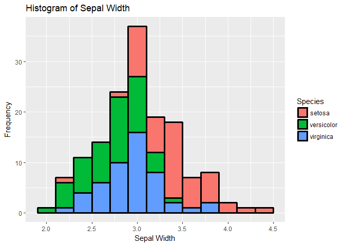
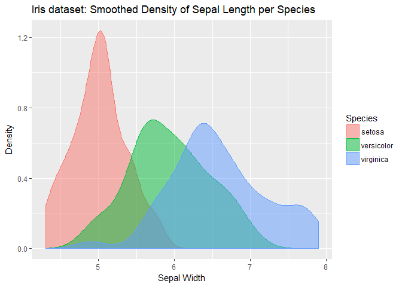
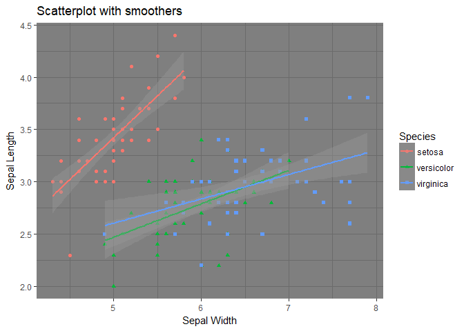
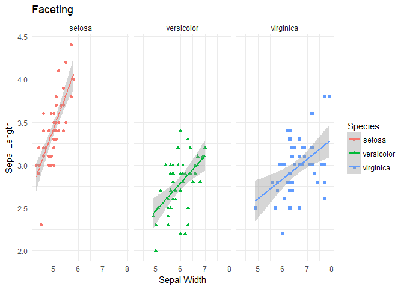
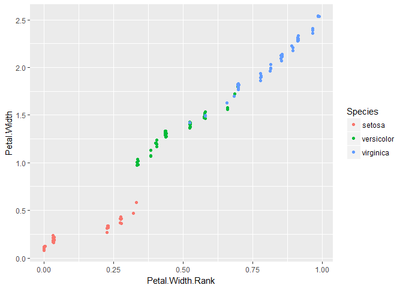

Machine Learning - 1st Exercise
================
Jan Hynek
1 listopadu 2017

R Markdown
----------

This is an R Markdown document. Markdown is a simple formatting syntax for authoring HTML, PDF, and MS Word documents. For more details on using R Markdown see <http://rmarkdown.rstudio.com>.

When you click the **Knit** button a document will be generated that includes both content as well as the output of any embedded R code chunks within the document. You can embed an R code chunk like this:

``` r
library(tidyverse)
```

    ## Loading tidyverse: ggplot2
    ## Loading tidyverse: tibble
    ## Loading tidyverse: tidyr
    ## Loading tidyverse: readr
    ## Loading tidyverse: purrr
    ## Loading tidyverse: dplyr

    ## Conflicts with tidy packages ----------------------------------------------

    ## filter(): dplyr, stats
    ## lag():    dplyr, stats

``` r
str(iris)
```

    ## 'data.frame':    150 obs. of  5 variables:
    ##  $ Sepal.Length: num  5.1 4.9 4.7 4.6 5 5.4 4.6 5 4.4 4.9 ...
    ##  $ Sepal.Width : num  3.5 3 3.2 3.1 3.6 3.9 3.4 3.4 2.9 3.1 ...
    ##  $ Petal.Length: num  1.4 1.4 1.3 1.5 1.4 1.7 1.4 1.5 1.4 1.5 ...
    ##  $ Petal.Width : num  0.2 0.2 0.2 0.2 0.2 0.4 0.3 0.2 0.2 0.1 ...
    ##  $ Species     : Factor w/ 3 levels "setosa","versicolor",..: 1 1 1 1 1 1 1 1 1 1 ...

``` r
head(iris)
```

    ##   Sepal.Length Sepal.Width Petal.Length Petal.Width Species
    ## 1          5.1         3.5          1.4         0.2  setosa
    ## 2          4.9         3.0          1.4         0.2  setosa
    ## 3          4.7         3.2          1.3         0.2  setosa
    ## 4          4.6         3.1          1.5         0.2  setosa
    ## 5          5.0         3.6          1.4         0.2  setosa
    ## 6          5.4         3.9          1.7         0.4  setosa

``` r
summary(iris)
```

    ##   Sepal.Length    Sepal.Width     Petal.Length    Petal.Width   
    ##  Min.   :4.300   Min.   :2.000   Min.   :1.000   Min.   :0.100  
    ##  1st Qu.:5.100   1st Qu.:2.800   1st Qu.:1.600   1st Qu.:0.300  
    ##  Median :5.800   Median :3.000   Median :4.350   Median :1.300  
    ##  Mean   :5.843   Mean   :3.057   Mean   :3.758   Mean   :1.199  
    ##  3rd Qu.:6.400   3rd Qu.:3.300   3rd Qu.:5.100   3rd Qu.:1.800  
    ##  Max.   :7.900   Max.   :4.400   Max.   :6.900   Max.   :2.500  
    ##        Species  
    ##  setosa    :50  
    ##  versicolor:50  
    ##  virginica :50  
    ##                 
    ##                 
    ## 

Including Plots
---------------

You can also embed plots, for example:



``` r
ggplot(data = iris) + geom_density(aes(x = iris$Sepal.Length, fill = Species, col = Species), alpha = 0.5)+
  xlab('Sepal Width') +
  ylab('Density') + 
  ggtitle('Iris dataset: Smoothed Density of Sepal Length per Species')
```



``` r
ggplot(iris) + 
  geom_point(aes(x = iris$Sepal.Length, y=iris$Sepal.Width, col = Species, shape = Species)) +
  geom_smooth(method = lm, aes(x = iris$Sepal.Length, y=iris$Sepal.Width, col = Species))+
  xlab('Sepal Width') +
  ylab('Sepal Length') + 
  ggtitle('Scatterplot with smoothers') + theme_dark()
```



``` r
ggplot(iris) + 
  geom_point(aes(x = iris$Sepal.Length, y=iris$Sepal.Width, col = Species, shape = Species)) +
  geom_smooth(method = lm, aes(x = iris$Sepal.Length, y=iris$Sepal.Width, col = Species)) + facet_grid(. ~ Species) +
  xlab('Sepal Width') +
  ylab('Sepal Length') + 
  ggtitle('Faceting') + theme_minimal()
```



``` r
iris %>% filter(Species == 'virginica') %>% summary
```

    ##   Sepal.Length    Sepal.Width     Petal.Length    Petal.Width   
    ##  Min.   :4.900   Min.   :2.200   Min.   :4.500   Min.   :1.400  
    ##  1st Qu.:6.225   1st Qu.:2.800   1st Qu.:5.100   1st Qu.:1.800  
    ##  Median :6.500   Median :3.000   Median :5.550   Median :2.000  
    ##  Mean   :6.588   Mean   :2.974   Mean   :5.552   Mean   :2.026  
    ##  3rd Qu.:6.900   3rd Qu.:3.175   3rd Qu.:5.875   3rd Qu.:2.300  
    ##  Max.   :7.900   Max.   :3.800   Max.   :6.900   Max.   :2.500  
    ##        Species  
    ##  setosa    : 0  
    ##  versicolor: 0  
    ##  virginica :50  
    ##                 
    ##                 
    ## 

``` r
iris %>% select(starts_with('Petal')) %>% summary
```

    ##   Petal.Length    Petal.Width   
    ##  Min.   :1.000   Min.   :0.100  
    ##  1st Qu.:1.600   1st Qu.:0.300  
    ##  Median :4.350   Median :1.300  
    ##  Mean   :3.758   Mean   :1.199  
    ##  3rd Qu.:5.100   3rd Qu.:1.800  
    ##  Max.   :6.900   Max.   :2.500

``` r
iris_mut <- iris %>% 
  mutate(Petal.Width.Rank = percent_rank(Petal.Width)) %>% 
  arrange(Petal.Width.Rank)

ggplot(iris_mut) + 
  geom_jitter(aes(x=iris_mut$Petal.Width.Rank, y=iris_mut$Petal.Width, col = Species)) +
  xlab('Petal.Width.Rank') + ylab('Petal.Width')
```


