DSinR - Chapter 7
================
Jan Hynek
4 listopadu 2017

Exercises 7.3.4
---------------

``` r
ggplot(diamonds) +
  geom_histogram(mapping = aes(x = x), binwidth = 0.5, fill = "blue")
```

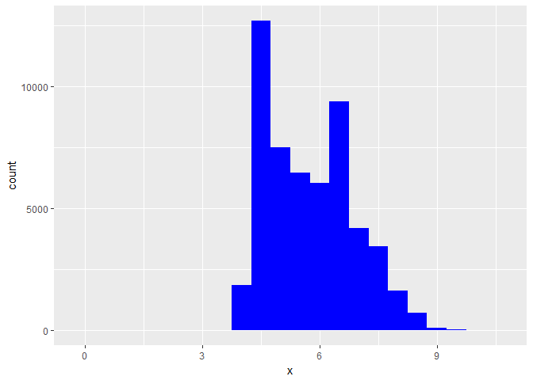

``` r
ggplot(diamonds) +
  geom_histogram(mapping = aes(x = z), binwidth = 0.5)
```

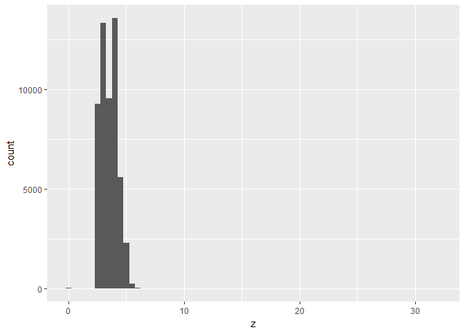

``` r
diamonds %>%
  filter(z < 1 | z > 10) %>%
  select(price, x, y, z, carat)
```

    ## # A tibble: 21 x 5
    ##    price     x     y     z carat
    ##    <int> <dbl> <dbl> <dbl> <dbl>
    ##  1  3142  6.55  6.48     0  1.00
    ##  2  3167  6.66  6.60     0  1.01
    ##  3  3696  6.50  6.47     0  1.10
    ##  4  3837  6.50  6.47     0  1.01
    ##  5  4731  7.15  7.04     0  1.50
    ##  6  4954  0.00  6.62     0  1.07
    ##  7  5139  0.00  0.00     0  1.00
    ##  8  5564  6.88  6.83     0  1.15
    ##  9  6381  0.00  0.00     0  1.14
    ## 10 12631  8.49  8.45     0  2.18
    ## # ... with 11 more rows

``` r
ggplot(diamonds) + 
  geom_histogram(mapping = aes(x = price), binwidth = 50)
```

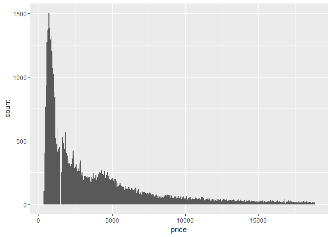 We can observe interesting dent around 1500. It is also worth noting that there is more diamonds with price 4xxx rather than with price 3xxx, what is kind of counterintuitive.

``` r
ggplot(diamonds) + 
  geom_histogram(mapping = aes(x = price), binwidth = 10) + coord_cartesian(xlim = c(1000, 2000))
```

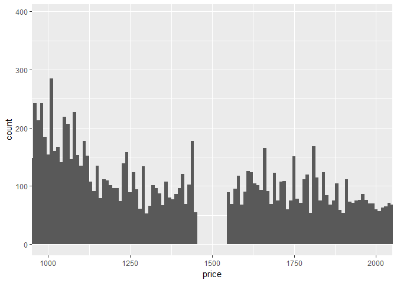

``` r
diamonds %>%
  filter(between(carat, 0.99, 1.0)) %>%
  group_by(carat) %>%
  summarise(count = n())
```

    ## # A tibble: 2 x 2
    ##   carat count
    ##   <dbl> <int>
    ## 1  0.99    23
    ## 2  1.00  1558

### 7.5.1.1 Exercises

``` r
nycflights13::flights %>% 
  mutate(
    cancelled = is.na(dep_time),
    sched_hour = sched_dep_time %/% 100,
    sched_min = sched_dep_time %% 100,
    sched_dep_time = sched_hour + sched_min / 60
  ) %>% 
  ggplot(mapping = aes(x = sched_dep_time, y = ..density..)) + 
    geom_freqpoly(mapping = aes(colour = cancelled), binwidth = 1)
```

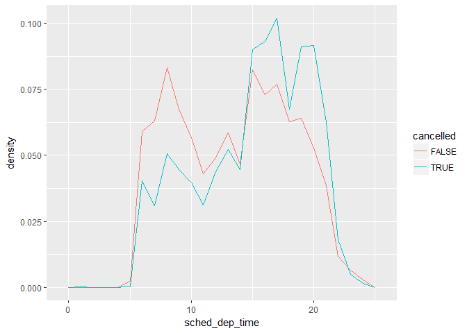

*What variable in the diamonds dataset is most important for predicting the price of a diamond? How is that variable correlated with cut? Why does the combination of those two relationships lead to lower quality diamonds being more expensive?*

Let's have a look. Let's take all floating variables and correlate them:

``` r
glimpse(diamonds)
```

    ## Observations: 53,940
    ## Variables: 10
    ## $ carat   <dbl> 0.23, 0.21, 0.23, 0.29, 0.31, 0.24, 0.24, 0.26, 0.22, ...
    ## $ cut     <ord> Ideal, Premium, Good, Premium, Good, Very Good, Very G...
    ## $ color   <ord> E, E, E, I, J, J, I, H, E, H, J, J, F, J, E, E, I, J, ...
    ## $ clarity <ord> SI2, SI1, VS1, VS2, SI2, VVS2, VVS1, SI1, VS2, VS1, SI...
    ## $ depth   <dbl> 61.5, 59.8, 56.9, 62.4, 63.3, 62.8, 62.3, 61.9, 65.1, ...
    ## $ table   <dbl> 55, 61, 65, 58, 58, 57, 57, 55, 61, 61, 55, 56, 61, 54...
    ## $ price   <int> 326, 326, 327, 334, 335, 336, 336, 337, 337, 338, 339,...
    ## $ x       <dbl> 3.95, 3.89, 4.05, 4.20, 4.34, 3.94, 3.95, 4.07, 3.87, ...
    ## $ y       <dbl> 3.98, 3.84, 4.07, 4.23, 4.35, 3.96, 3.98, 4.11, 3.78, ...
    ## $ z       <dbl> 2.43, 2.31, 2.31, 2.63, 2.75, 2.48, 2.47, 2.53, 2.49, ...

``` r
diamonds %>%
  select(carat, depth, table, price, x, y, z) %>%
  correlate() %>% focus(price)
```

    ## # A tibble: 6 x 2
    ##   rowname      price
    ##     <chr>      <dbl>
    ## 1   carat  0.9215913
    ## 2   depth -0.0106474
    ## 3   table  0.1271339
    ## 4       x  0.8844352
    ## 5       y  0.8654209
    ## 6       z  0.8612494

We can see that carats are strongly correlated with

``` r
ggplot(data = diamonds, mapping = aes(x = cut, y = carat)) +
  geom_boxplot()
```

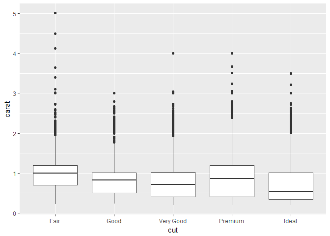

We can observe, that Fair diamonds have slightly more carats the Good or Very Good cut diamonds.

``` r
ggplot(data = diamonds, mapping = aes(x = carat, y = ..density..)) + 
  geom_freqpoly(mapping = aes(colour = cut), binwidth = 0.2)
```

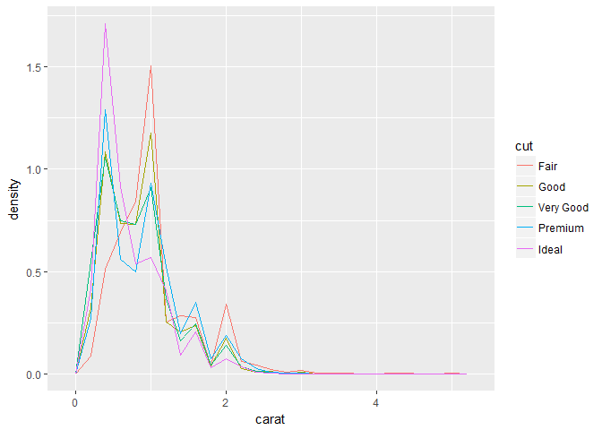

We can observe that fair cut diamonds tend to have more carats, and this might be the reason why they are more expensive.

``` r
ggplot(data = diamonds, mapping = aes(x = carat, y = price)) + 
  geom_violin(mapping = aes(colour = cut))
```

    ## Warning: position_dodge requires non-overlapping x intervals

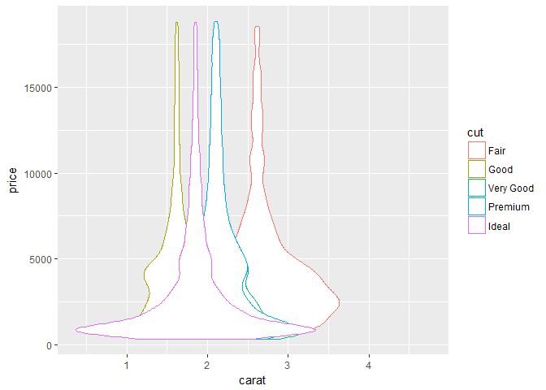

### 7.5.2.1 Exercises

*How could you rescale the count dataset above to more clearly show the distribution of cut within colour, or colour within cut?* I decided to use percentile rank of each count. This scales shows more of the variability in the data.

``` r
diamonds %>% 
  count(color, cut) %>% mutate(p_rank = percent_rank(n)) %>%  
  ggplot(mapping = aes(x = color, y = cut)) +
    geom_tile(mapping = aes(fill = p_rank))
```

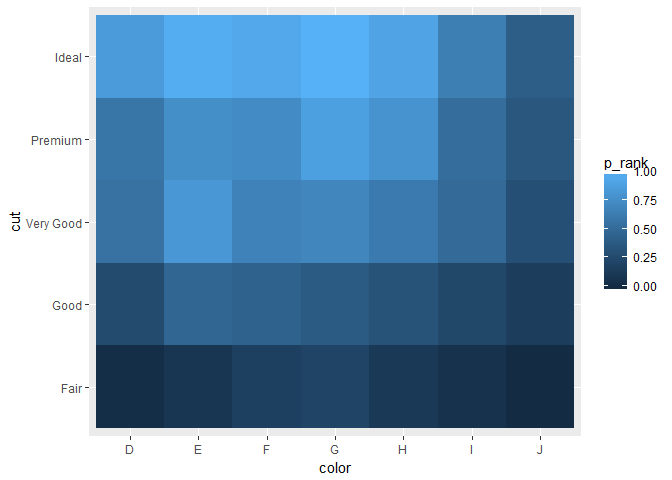

``` r
glimpse(nycflights13::flights)
```

    ## Observations: 336,776
    ## Variables: 19
    ## $ year           <int> 2013, 2013, 2013, 2013, 2013, 2013, 2013, 2013,...
    ## $ month          <int> 1, 1, 1, 1, 1, 1, 1, 1, 1, 1, 1, 1, 1, 1, 1, 1,...
    ## $ day            <int> 1, 1, 1, 1, 1, 1, 1, 1, 1, 1, 1, 1, 1, 1, 1, 1,...
    ## $ dep_time       <int> 517, 533, 542, 544, 554, 554, 555, 557, 557, 55...
    ## $ sched_dep_time <int> 515, 529, 540, 545, 600, 558, 600, 600, 600, 60...
    ## $ dep_delay      <dbl> 2, 4, 2, -1, -6, -4, -5, -3, -3, -2, -2, -2, -2...
    ## $ arr_time       <int> 830, 850, 923, 1004, 812, 740, 913, 709, 838, 7...
    ## $ sched_arr_time <int> 819, 830, 850, 1022, 837, 728, 854, 723, 846, 7...
    ## $ arr_delay      <dbl> 11, 20, 33, -18, -25, 12, 19, -14, -8, 8, -2, -...
    ## $ carrier        <chr> "UA", "UA", "AA", "B6", "DL", "UA", "B6", "EV",...
    ## $ flight         <int> 1545, 1714, 1141, 725, 461, 1696, 507, 5708, 79...
    ## $ tailnum        <chr> "N14228", "N24211", "N619AA", "N804JB", "N668DN...
    ## $ origin         <chr> "EWR", "LGA", "JFK", "JFK", "LGA", "EWR", "EWR"...
    ## $ dest           <chr> "IAH", "IAH", "MIA", "BQN", "ATL", "ORD", "FLL"...
    ## $ air_time       <dbl> 227, 227, 160, 183, 116, 150, 158, 53, 140, 138...
    ## $ distance       <dbl> 1400, 1416, 1089, 1576, 762, 719, 1065, 229, 94...
    ## $ hour           <dbl> 5, 5, 5, 5, 6, 5, 6, 6, 6, 6, 6, 6, 6, 6, 6, 5,...
    ## $ minute         <dbl> 15, 29, 40, 45, 0, 58, 0, 0, 0, 0, 0, 0, 0, 0, ...
    ## $ time_hour      <dttm> 2013-01-01 05:00:00, 2013-01-01 05:00:00, 2013...

``` r
nycflights13::flights %>% count(month, dest) %>%
  ggplot(mapping = aes(x = month, y = dest)) +
  geom_tile(aes(fill = n))
```

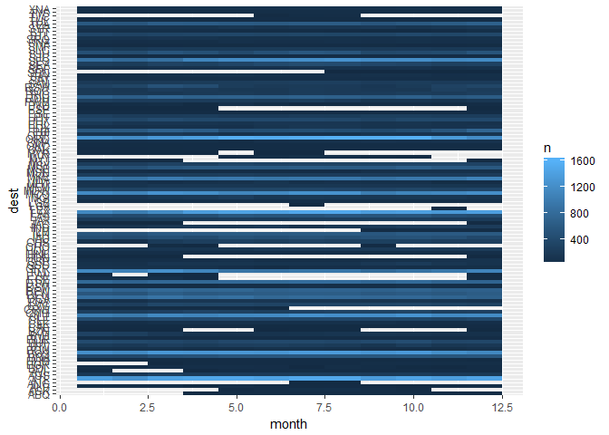

### 7.5.3.1 Exercises

*Instead of summarising the conditional distribution with a boxplot, you could use a frequency polygon. What do you need to consider when using cut\_width() vs cut\_number()? How does that impact a visualisation of the 2d distribution of carat and price?*

``` r
diamonds %>% mutate(price_perc = factor(ntile(price, 5))) %>%
  ggplot(mapping = aes(x = carat, y = ..density..)) + 
    geom_freqpoly(mapping = aes(colour = price_perc), binwidth = 0.1)
```

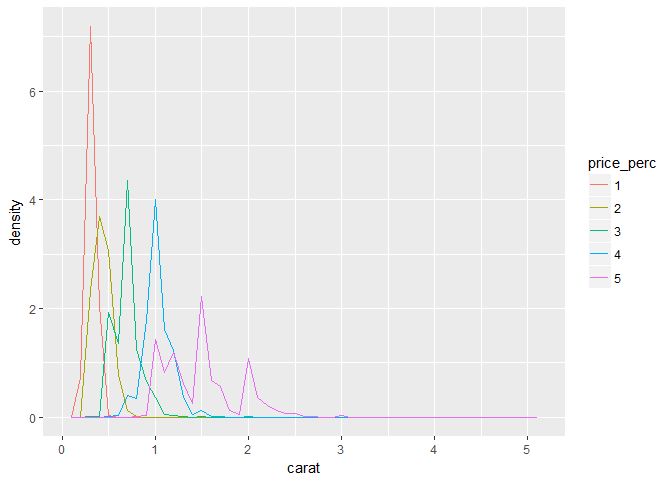

``` r
diamonds %>% mutate(price_perc = factor(ntile(price, 6)))
```

    ## # A tibble: 53,940 x 11
    ##    carat       cut color clarity depth table price     x     y     z
    ##    <dbl>     <ord> <ord>   <ord> <dbl> <dbl> <int> <dbl> <dbl> <dbl>
    ##  1  0.23     Ideal     E     SI2  61.5    55   326  3.95  3.98  2.43
    ##  2  0.21   Premium     E     SI1  59.8    61   326  3.89  3.84  2.31
    ##  3  0.23      Good     E     VS1  56.9    65   327  4.05  4.07  2.31
    ##  4  0.29   Premium     I     VS2  62.4    58   334  4.20  4.23  2.63
    ##  5  0.31      Good     J     SI2  63.3    58   335  4.34  4.35  2.75
    ##  6  0.24 Very Good     J    VVS2  62.8    57   336  3.94  3.96  2.48
    ##  7  0.24 Very Good     I    VVS1  62.3    57   336  3.95  3.98  2.47
    ##  8  0.26 Very Good     H     SI1  61.9    55   337  4.07  4.11  2.53
    ##  9  0.22      Fair     E     VS2  65.1    61   337  3.87  3.78  2.49
    ## 10  0.23 Very Good     H     VS1  59.4    61   338  4.00  4.05  2.39
    ## # ... with 53,930 more rows, and 1 more variables: price_perc <fctr>
